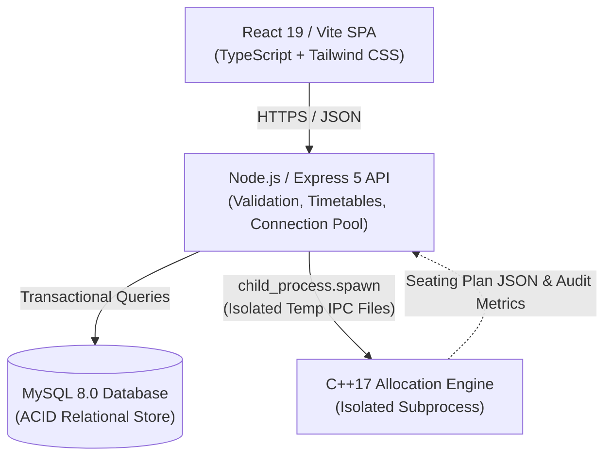

# Intelligent Exam Seating Arrangement System

> A full-stack examination seating system that combines a React dashboard, Express API, MySQL persistence, and a native C++17 allocation engine.

**Stack:** React 19 · TypeScript · Vite · Node.js · Express · MySQL · C++17 · Docker

**Live Demo:** [intelligent-exam-seating-aqfzv91q7.vercel.app](https://intelligent-exam-seating-aqfzv91q7.vercel.app)  
**API Health:** [intelligent-exam-seating-arrangement.onrender.com/api/health](https://intelligent-exam-seating-arrangement.onrender.com/api/health)  

---

## Overview

Automating examination seating requires balancing classroom capacity constraints, branch diversification, and spatial separation to minimize proximity between candidates from the same academic section. Manual or naive sequential assignments frequently produce clustering, timetable clashes, and suboptimal room utilization.

This system manages students, classrooms, examinations, and registrations through a centralized dashboard. When an exam seating plan is generated, the backend prepares structured room geometry and student rosters, offloading the combinatorial seat assignment to a dedicated C++17 allocation engine.

The generated seating arrangements, along with conflict statistics and execution metrics, are persisted through atomic MySQL transactions. The application is designed for multi-service deployment across Vercel, Render, and managed MySQL (Aiven) or locally through Docker Compose.

---

## Live Deployment

| Component | Platform | Purpose |
|---|---|---|
| Frontend | Vercel | React 19 / Vite SPA dashboard and 2D seating visualization |
| Backend | Render | Express REST API and native C++ engine orchestration |
| Database | Aiven MySQL | Managed relational database with TLS/SSL encryption |
| Allocation Engine | C++17 | Constraint-based seating optimization and audit |

**Frontend:** [https://intelligent-exam-seating-aqfzv91q7.vercel.app](https://intelligent-exam-seating-aqfzv91q7.vercel.app)  
**API Health:** [https://intelligent-exam-seating-arrangement.onrender.com/api/health](https://intelligent-exam-seating-arrangement.onrender.com/api/health)  

> The deployed environment contains demonstration data for students, classrooms, examinations, and registrations.

---

## Architecture



The backend server orchestrates data access and acts as a gateway. When seating allocation is requested, the backend extracts the examination roster and venue dimensions, writes a temporary JSON input file, and invokes the compiled C++ native binary as an isolated child process. The resulting JSON stream is parsed, validated, and stored inside a single database transaction.

---

## Core Capabilities

- **Candidate and Registration Management:** Directory CRUD operations, section tracking, and multi-student exam registration.
- **Classroom Inventory Configuration:** Configurable venue blueprints with row and column dimensions and automated capacity computation.
- **Examination Timetable Scheduling:** Date, time, and duration management with schedule conflict prevention.
- **Classroom Availability & Clash Detection:** Evaluates room availability against overlapping exam slots on the same date.
- **Section-Aware Seating Allocation:** Combinatorial student placement that separates same-section candidates using dynamic cooldowns and spatial penalty scoring.
- **2D Classroom Seating Visualization:** Interactive grid rendering with section color-coding, seat coordinate labels, and hover details.
- **CSV Roster Import:** Bulk student record ingestion with field normalization and duplicate key handling.
- **Data Export:** Export generated arrangements to CSV or JSON formats for physical posting and records.
- **Transactional Persistence:** Atomically writes seating plans and seat assignments, rolling back on allocation or database errors.
- **Automated Multi-Layer Testing:** Unit and integration coverage spanning API routes, C++ invariants, and regression fixtures.

---

## Allocation Engine

The seating allocation engine (`cpp-engine/`) is implemented in C++17 and executes as a standalone optimization pipeline:

```text
[Input JSON] -> [Validator] -> [Balancer] -> [Distributor] -> [Traversal] -> [Scorer] -> [Allocator] -> [Statistics Audit] -> [Output JSON]
```

### 1. Invariant Validation
The engine enforces 9 pre-flight invariants before processing:
- Non-empty candidate and room lists.
- Global uniqueness of Student IDs, Roll Numbers, and Classroom IDs.
- Mandatory candidate section assignments.
- Positive grid dimensions ($rows > 0 \land cols > 0$).
- Total venue capacity $\ge$ total registered candidates.
- Seat exclusivity invariant (at most one student per grid coordinate).

### 2. Stream Interleaving and Section Balancing
Candidates are grouped by academic section into FIFO queues. A **Max-Heap Priority Queue** paired with a **Dynamic Cooldown Ring** interleaves students from high-density sections with a spacing cooldown:

$$T = \max\left(2, \left\lfloor \frac{N}{\text{freq}_{\max}} \right\rfloor\right)$$

This prevents candidates from the same academic section from appearing consecutively in the allocation stream.

### 3. Spatial Penalty Scoring
Candidates are placed across rooms using configurable 2D grid traversals (Snake, Spiral, Checkerboard, Center-Out, or Row-Major). For each empty desk coordinate $(r, c)$, the engine evaluates an objective penalty function:

$$\min S(r, c) = P_{\text{ortho}} + P_{\text{diag}} + P_{\text{dist2}} + P_{\text{row}} + P_{\text{col}}$$

- **Orthogonal Penalty ($P_{\text{ortho}}$):** $+10$ per same-section neighbor in 4 cardinal directions (Up, Down, Left, Right); adds $+100,000$ offset when strict adjacency avoidance is active.
- **Diagonal Penalty ($P_{\text{diag}}$):** $+3$ per same-section neighbor in 4 diagonal directions.
- **Proximity Penalty ($P_{\text{dist2}}$):** $+1$ per same-section candidate within Manhattan distance $\le 2$ ($5 \times 5$ subgrid).
- **Row/Column Clustering Penalties:** $+1$ if $\ge 2$ same-section students share the row; $+2$ if $\ge 2$ share the column.

### 4. Post-Allocation Conflict Audit
A post-allocation audit scans the final room matrices in a single directional pass (Right, Down, Down-Right, Down-Left) to record orthogonal and diagonal conflict counts without double counting.

---

## Engineering Decisions

### Native C++ Allocation Engine
Combinatorial desk placement and distance evaluations are isolated in a native C++17 binary rather than executed inside the Node.js event loop. This gives explicit control over memory layouts, enables compiler optimizations (`-O3`), and allows the solver to be tested and benchmarked independently.

### Transactional Persistence
Database operations for seating generation are wrapped inside MySQL transactions (`START TRANSACTION`, `COMMIT`, `ROLLBACK`). If the allocation process or database insert fails at any point, previous state remains untouched and no orphaned seat records are stored.

### Process Isolation
The Node.js backend invokes the allocator using `child_process.spawn` with unique temporary JSON files in the operating system temp directory (`os.tmpdir()`). Process execution is bounded by timeout handlers, and temporary input/output files are removed in `finally` blocks to prevent disk leaks.

### Relational Connection Pooling
Database connections use a `mysql2` pool configured with keep-alive, automatic reconnection, and configurable connection limits, ensuring stability under concurrent API requests.

### Cross-Platform Native Builds
The allocation engine supports compilation via CMake (`CMakeLists.txt`), Make (`Makefile`), or direct compiler commands across Linux, macOS, and Windows.

---

## Data Model

```text
departments ──< students ──< exam_registrations >── exams ──< seating_plans ──< seat_assignments
                                                                   │
classrooms ────────────────────────────────────────────────────────┴──< seat_assignments
```

- **`departments`**: Academic divisions (`department_id`, `department_name`, `department_code`, `home_zone`).
- **`students`**: Candidate records (`student_id`, `roll_no`, `first_name`, `last_name`, `department_id`, `section`, `semester`) referencing `departments`.
- **`classrooms`**: Venue layouts (`classroom_id`, `room_no`, `rows_count`, `cols_count`, `capacity`).
- **`exams`**: Timetables (`exam_id`, `exam_name`, `subject_code`, `subject_name`, `semester`, `exam_date`, `start_time`, `end_time`, `status`).
- **`exam_registrations`**: Many-to-many junction binding students to scheduled exams with a unique constraint on `(exam_id, student_id)`.
- **`seating_plans`**: Plan run summaries (`plan_id`, `exam_id`, `algorithm_version`, `total_students`, `occupied_seats`, `empty_seats`, `conflict_count`, `execution_time_ms`) with cascading delete on exam removal.
- **`seat_assignments`**: Specific desk coordinate allocations (`assignment_id`, `plan_id`, `student_id`, `classroom_id`, `row_no`, `col_no`, `seat_label`) with unique constraints on `(plan_id, student_id)` and `(plan_id, classroom_id, row_no, col_no)`.

---

## Tech Stack

| Layer | Technology | Role |
|---|---|---|
| Frontend | React 19, TypeScript, Vite, Tailwind CSS | Single-page application and interactive 2D grid matrix |
| API | Node.js (v20+), Express 5 | REST API gateway, validation, and child process orchestration |
| Database | MySQL 8.0, `mysql2` Pool | Relational storage, foreign keys, and ACID transactions |
| Allocation Engine | C++17 (STL) | Constraint-based allocation, scoring, and conflict audit |
| Build System | CMake, Make | Native allocation engine compilation |
| Testing | Node Test Runner, C++ Custom Runner | Automated API integration and native engine verification |
| Deployment | Docker, Vercel, Render, Aiven | Containerized local orchestration and cloud deployment |

---

## API

| Domain | Method | Endpoint | Description |
|---|---|---|---|
| **Health** | `GET` | `/api/health` | Service health status and database connectivity check |
| **Dashboard** | `GET` | `/api/dashboard/stats` | Aggregate roster statistics, room capacity, and latest run metrics |
| **Students** | `GET` | `/api/students` | Lists all student records |
| | `GET` | `/api/students/details` | Lists student records with joined department data |
| | `GET` | `/api/students/:id` | Retrieves a single student record |
| | `POST` | `/api/students` | Creates a new student record |
| | `PUT` | `/api/students/:id` | Updates an existing student record |
| | `DELETE` | `/api/students/:id` | Removes a student record |
| | `POST` | `/api/students/upload` | Parses and imports candidate rosters from CSV |
| **Classrooms** | `GET` | `/api/classrooms` | Lists all classrooms and capacity dimensions |
| | `GET` | `/api/classrooms/availability/:examId` | Checks hall availability against concurrent exam schedules |
| | `GET` | `/api/classrooms/:id` | Retrieves a single classroom record |
| | `POST` | `/api/classrooms` | Creates a new classroom record |
| | `PUT` | `/api/classrooms/:id` | Updates classroom dimensions and capacity |
| | `DELETE` | `/api/classrooms/:id` | Removes a classroom record |
| **Exams** | `GET` | `/api/exams` | Lists all scheduled examinations |
| | `GET` | `/api/exams/:id` | Retrieves a single examination schedule |
| | `POST` | `/api/exams` | Creates a new examination schedule |
| | `PUT` | `/api/exams/:id` | Updates an examination schedule |
| | `DELETE` | `/api/exams/:id` | Removes an examination schedule |
| **Registrations** | `GET` | `/api/registrations` | Lists all exam registrations |
| | `GET` | `/api/registrations/details` | Lists registrations with joined candidate and exam details |
| | `GET` | `/api/registrations/exam/:examId` | Lists candidates registered for a specific exam |
| | `GET` | `/api/registrations/:id` | Retrieves a single registration record |
| | `POST` | `/api/registrations` | Creates a single exam registration |
| | `POST` | `/api/registrations/bulk` | Bulk registers candidate IDs to an exam session |
| | `POST` | `/api/registrations/bulk-delete` | Bulk unregisters candidate IDs from an exam session |
| | `DELETE` | `/api/registrations/:id` | Removes a registration by ID |
| | `DELETE` | `/api/registrations/exam/:examId/student/:studentId` | Removes a candidate registration for a specific exam |
| **Seating** | `POST` | `/api/seating/generate` | Triggers C++ solver and persists seating plan in a transaction |
| | `GET` | `/api/seating/:examId` | Retrieves active seating layout and desk assignments for an exam |
| | `GET` | `/api/seating-plans` | Lists seating plan execution records |
| | `GET` | `/api/seating-plans/details` | Lists seating plans with exam details |
| | `GET` | `/api/seating-plans/:id` | Retrieves a single seating plan record |
| | `DELETE` | `/api/seating-plans/:id` | Deletes a seating plan and cascading seat assignments |

---

## Testing

The test suite covers three distinct verification layers:

### 1. Backend and API Tests
Automated tests verify endpoint responses, input validation, transaction rollback behavior, and child process invocation using the Node.js native test runner:
```bash
cd backend
npm test
```

### 2. C++ Unit Tests
Tests algorithm invariants, priority queue ordering, dynamic cooldown bounds, and traversal logic:
```bash
cd cpp-engine
g++ -std=c++17 tests/*.cpp src/validator.cpp src/balancer.cpp src/traversal.cpp src/scorer.cpp src/distributor.cpp src/statistics.cpp -Iinclude -o test_runner
./test_runner
```

### 3. C++ Regression Test Suite
A suite of 17 JSON test fixtures in `cpp-engine/test/` validates capacity overflow rejection, duplicate key guards, invalid room dimensions, single-section cohorts, and traversal strategies (Snake, Spiral, Checkerboard, Center-Out):
```bash
cd cpp-engine
# Windows:
.\run_tests.bat
```

---

## Local Development

### Prerequisites
- Node.js 20+
- MySQL 8.0+
- C++17 compliant compiler (GCC 9+, Clang 10+, or MSVC 2019+)
- CMake 3.10+ or Make
- Docker and Docker Compose (optional)

### Docker Compose (Recommended)

To build and run all services with the C++ engine compiled automatically inside the container:

```bash
# 1. Clone repository
git clone https://github.com/06Pseudo06/Intelligent-Exam-Seating-Arrangement-System.git
cd Intelligent-Exam-Seating-Arrangement-System

# 2. Start services
docker compose up --build
```

- **Frontend:** `http://localhost:5173`
- **Backend API:** `http://localhost:5000`
- **API Health:** `http://localhost:5000/api/health`
- **MySQL Database:** `localhost:3306`

### Manual Setup

#### 1. Database Setup
```bash
mysql -u root -p < backend/database/schema.sql
mysql -u root -p < backend/database/sample_data.sql
```

#### 2. Compile C++ Allocation Engine
```bash
cd cpp-engine

# Using GCC / Clang on Linux/macOS:
g++ -std=c++17 -O3 src/*.cpp -Iinclude -o allocator

# Using GCC on Windows:
g++ -std=c++17 -O3 src/*.cpp -Iinclude -o allocator.exe

# Or using CMake:
cmake -B build
cmake --build build --config Release
```

#### 3. Backend Setup
```bash
cd backend
cp .env.example .env
# Edit .env with your local MySQL credentials
npm install
npm run dev
```

#### 4. Frontend Setup
```bash
cd frontend
cp .env.example .env
npm install
npm run dev
```

---

## Configuration

Environment variables are configured in `.env` files based on `.env.example` templates:

### Backend Configuration (`backend/.env`)
```env
PORT=5000
NODE_ENV=development
CORS_ORIGIN=http://localhost:5173

DB_HOST=localhost
DB_PORT=3306
DB_USER=root
DB_PASSWORD=your_password
DB_NAME=exam_seating_db

# SSL Configuration for Managed Cloud MySQL (e.g. Aiven)
DB_SSL=false
DB_SSL_REJECT_UNAUTHORIZED=true
# DB_SSL_CA=/path/to/ca.pem

# Optional: Path to custom compiled allocator binary
# CPP_ALLOCATOR_BIN=
```

### Frontend Configuration (`frontend/.env`)
```env
VITE_API_BASE_URL=http://localhost:5000/api
```

---

## Deployment

The application is architected for independent, multi-service deployment:

- **Frontend (Vercel):** Built using `npm run build` and served as a static SPA. Client-side routing for `/students`, `/classrooms`, `/exams`, and `/seating-plan` is configured through `frontend/vercel.json` rewrites.
- **Backend (Render):** Deployed as a web service. The build phase compiles the C++ allocator binary and installs Node dependencies. The runtime executes Express and invokes the allocator binary.
- **Database (Aiven MySQL):** Managed MySQL 8.0 instance configured with TLS/SSL connections and pool management (`DB_SSL=true`).
- **Secrets Management:** Database credentials, SSL certificates, and environment settings are provided via deployment environment variables rather than committed files.

---

## Security and Reliability

- **Credential Isolation:** Credentials, `.env` files, and SSL certificate files are excluded from source control via `.gitignore`.
- **Parameterized Queries:** All SQL queries use prepared statements (`?`) to prevent SQL injection.
- **Atomic Transactions:** Database operations wrap plan generation and seat assignments in transactional blocks to prevent partial writes.
- **Process Isolation:** The native C++ engine executes in an isolated child process with timeout constraints and randomized temporary file paths.
- **CORS Configuration:** Explicit origin whitelisting protects API endpoints.
- **Centralized Error Handling:** Global middleware captures unhandled exceptions and standardizes API error responses.

---

## Project Structure

```
.
├── backend/
│   ├── database/
│   │   ├── schema.sql               # Relational DDL definitions
│   │   └── sample_data.sql          # Seed dataset (Departments, Students, Halls, Exams)
│   ├── src/
│   │   ├── config/db.js             # MySQL connection pool and SSL configuration
│   │   ├── controllers/             # Express route controllers
│   │   ├── routes/                  # REST endpoint definitions
│   │   └── services/                # Allocation runner and database transactions
│   ├── tests/                       # Automated API and process runner tests
│   ├── server.js                    # Express application entry point
│   ├── Dockerfile                   # Multi-stage container build
│   └── package.json
│
├── cpp-engine/
│   ├── include/                     # Solver header files
│   ├── src/                         # Engine implementations (validator, balancer, scorer)
│   ├── tests/                       # C++ native unit tests
│   ├── test/                        # 17 JSON regression test fixtures
│   ├── CMakeLists.txt               # CMake build configuration
│   └── Makefile                     # Make build configuration
│
├── frontend/
│   ├── src/
│   │   ├── components/              # UI components, modals, and tables
│   │   ├── pages/                   # Dashboard, Students, Classrooms, Exams, SeatingPlan
│   │   ├── routes/                  # React Router definitions
│   │   └── services/api.ts          # Axios API client
│   ├── vercel.json                  # Vercel SPA rewrite routing rules
│   ├── Dockerfile                   # Nginx production build
│   └── package.json
│
├── docker-compose.yml               # Multi-container orchestration
└── README.md
```

---

## License

This project is licensed under the ISC License.
